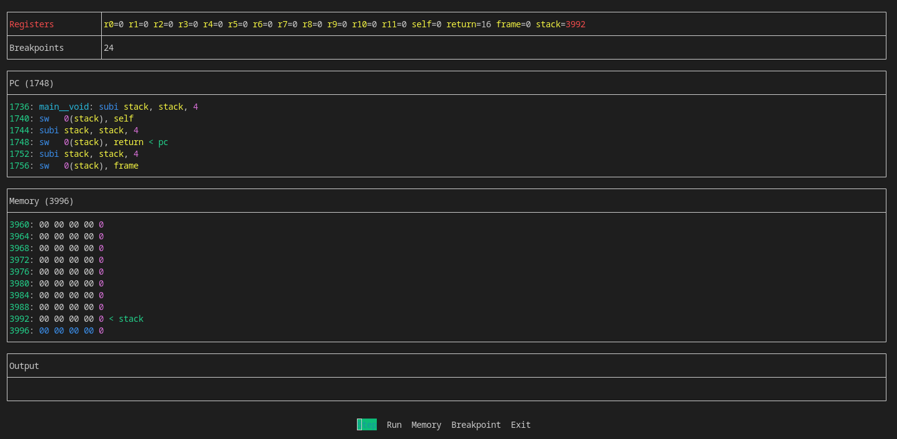

# Moon

A re-implementation of [P. Grogono](https://www.concordia.ca/news/media-relations/experts/expert-profile.html?epid=lN-dXztD3ph82n_UxB0sOw)'s Moon Processor/Debugger.



## 🚩 Getting Started

### 🔗 Requirements

- [Node.js](https://nodejs.org/en/) + [npm](https://www.npmjs.com/)

Dependencies can be installed using:

```
npm install
```

### 💿 Usage

Debugger can run on provided assembly files:

```
npm run node [/path/to/lib.m ...] /path/to/main.m
```

## 📌 Menu

### 👣 Step

Performs a single instruction at `PC`.

### 🏃‍♂️ Run

Excutes code until a `breakpoint` or `hlt`.

### 🧠 Memory

#### Up

Moves memory window up by 1 word (decreases memory).

#### Down

Moves memory window down by 1 word (increases memory).

#### Offset

- `n`: Sets window address.
- `+n`: Adds `n` bytes to window address.
- `-n`: Removes `n` bytes from window address.

#### Track

- `r1`, `r2`, ...: Follows the memory address at register `rn`.

### 🔴 Breakpoint

- `n`: Sets/unsets a breakpoint at address `n`.
- `+n`: Sets/unsets a breakpoint as address `PC + n`.
- `-n`: Sets/unsets a breakpoint as address `PC - n`.
- `symbol`: Sets/unsets a breakpoint at the address of `symbol`.

## ⚙️ Config

A `./moon.json` file can be created in this directory to modify the functioning of the VM. Settings are based off the type in `./src/config.ts`. This is the configuration as of now:

```
architecture: The architecture to run in (32/64).
memory: The size of memory in bytes.
window: The number of lines in the memory views (must be a multiple of 2).
registers: Renames a register rn to a new name (enter as `"rn": "new_name"`).
```

## 📃 License

This software is licensed relative to P. Grogono's design and the package dependencies. Any additional code created by myself is under the [MIT license](./LICENSE).
